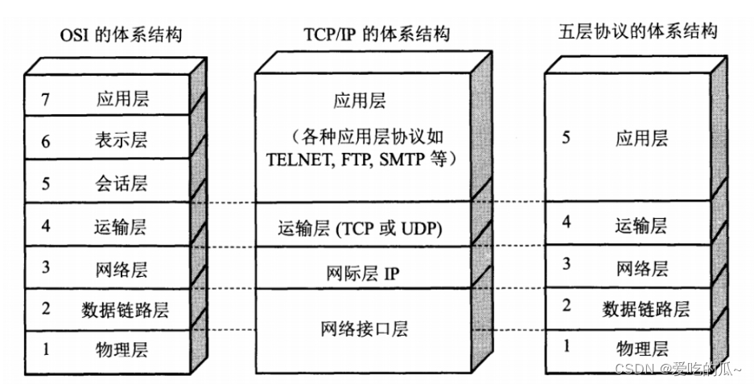
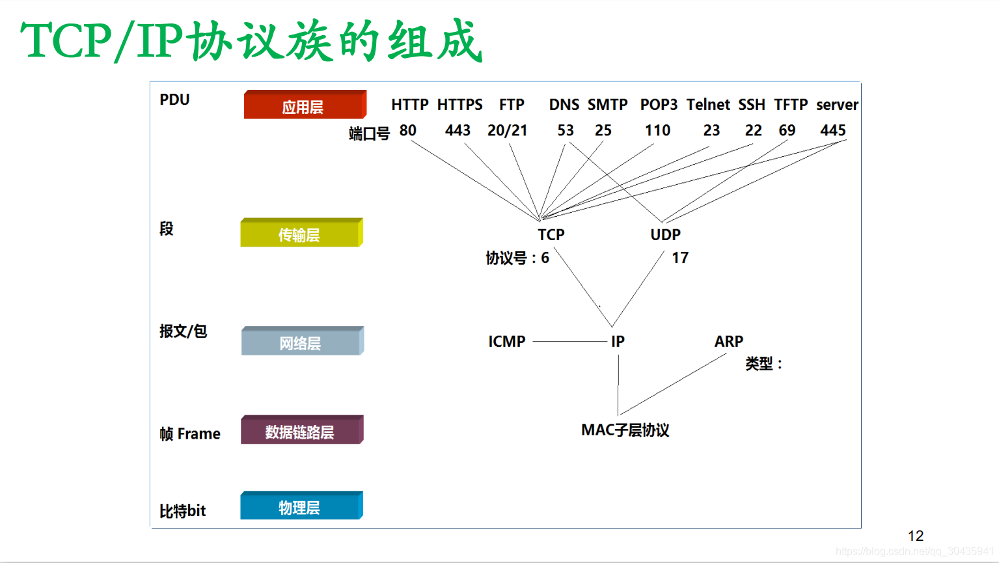
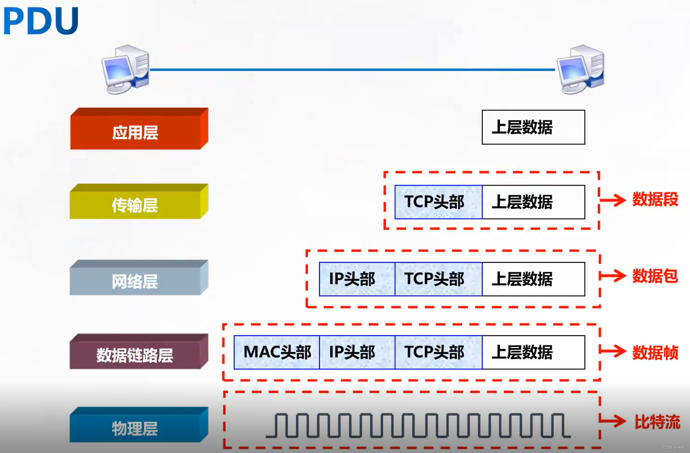

## 爬虫的底层基础

### 网络分层协议

[计算机网络OSI七层结构、TCP/IP四层模型、网络五层结构](https://blog.csdn.net/wzw_wwl/article/details/136627715)

| 层级 | 硬件和协议|
| ----- | --------- |
|应用层	| http 超文本传输协议 smtp 电子邮件协议 ftp 文件传输协议 telnet 远程登陆协议 dns域名系统|
|表示层|LPP、NBSSP|
|会话层|SSL、TLS、DAP、LDAP|
|传输层| TCP, UDP|
|网络层| IP协议 |
|数据链路层|以太网、网卡（MAC地址）、交换机、PPTP、L2TP、ARP、ATMP|
|物理层	|网线、光纤、无线电波、中继器、集线器，双絞线（传输bite）|

### TCP/IP协议简介

TCP/IP 协议，它是全世界互联网数据传输的统一标准和规范。

TCP/IP 协议，应该叫 TCP/IP 协议族(协议组)。是基于TCP和IP这两个最初的协议之上的，不同的通信协议的大的集合。

TCP/IP 协议族可分为五层：物理层、数据链路层、网络层、传输层和应用层。

网络层有 IP 协议、ICMP 协议、ARP 协议、RARP 协议和 BOOTP 协议。

在传输层中有 TCP 协议与 UDP 协议。

在应用层有 HTTP、FTP、TELNET、SMTP、DNS 等协议。

### HTTP协议简介

1. 释名： HTTP 协议是 HyperTextTransferProtocol（超文本传输协议）的缩写。

2. 源流：提到 HTTP 协议，就得提到 TCP/IP 协议，它是全世界互联网数据传输的统一标准和规范。`TCP/IP协议族` 通常分为四层（也有分为五层的），又叫 `TCP/IP四层模型` ：网络接口层（物理层和数据链路层），网络层，传输层，应用层。HTTP 为 `应用层` 协议 ，基于传输层的 TCP 协议。

3. 特点：默认占用服务端 80 端口。在正式的数据传输之前，要先经过 3 次握手确认连接。比 udp 协议速度慢，而可靠性强。内容包含：请求和响应的消息头 header 和消息体 body

4. 应用场景：平时浏览网页和应用程序的接口数据交互。

5. 请求动作：GET,POST,PUT,DELETE 等。

### 数据封装打包

数据的封装打包过程为：原始数据→数据段→数据包→数据帧→比特流

1. 应用层：原始数据被转换成二进制数据
2. 传输层：数据被打上传输层头部比如TCP头部，封装成Segment 数据段。此步关键信息是端口号。
3. 网络层：会给数据打上IP头部，封装成Packet数据包，此步关键信息是源目ip地址。
4. 数据链路层 ：会给数据打上帧头部，封装成Frame数据帧，头部中关键信息是源目MAC地址。
5. 物理层：在网线或者光纤上将二进制数据封装成高低电频信号或者光信号。

数据帧最终在物理层上（双绞线、光纤跳线）上以电信号或光信号进行传播转发。
这种协议栈逐层向下传递数据，并添加报头和报尾的过程称为封装

数据封装与解封装过程: https://zhuanlan.zhihu.com/p/555508423

