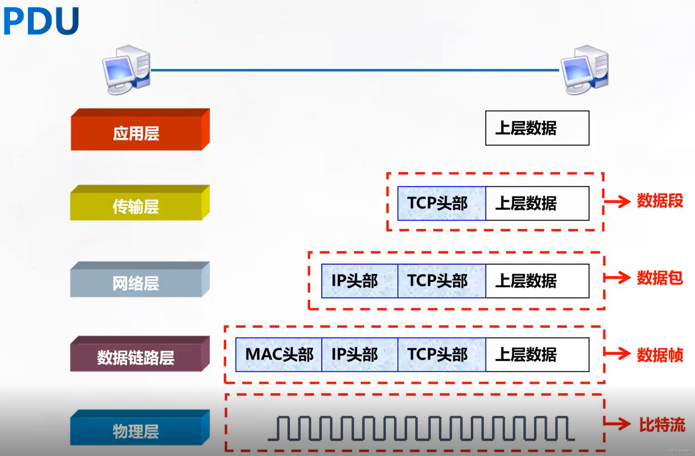
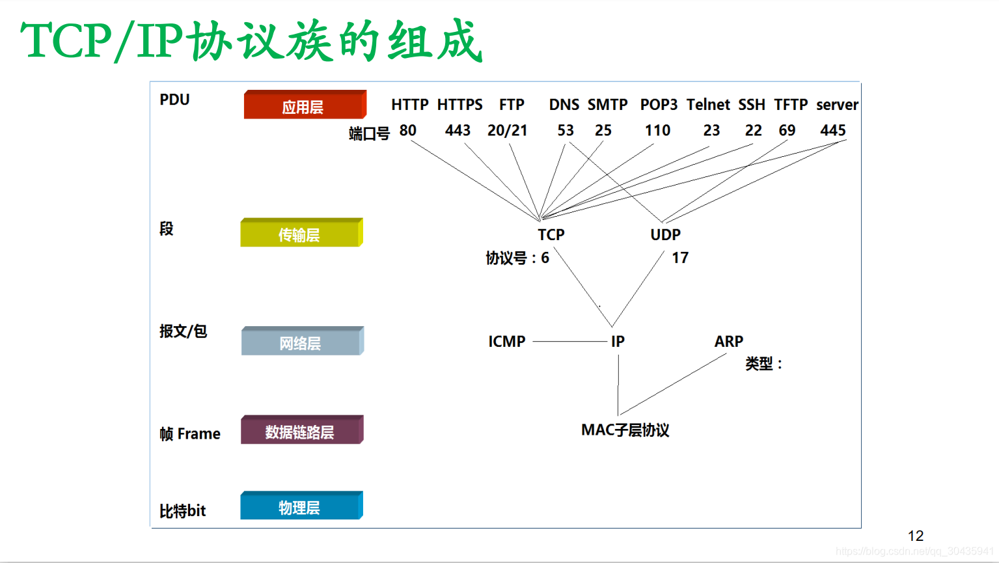
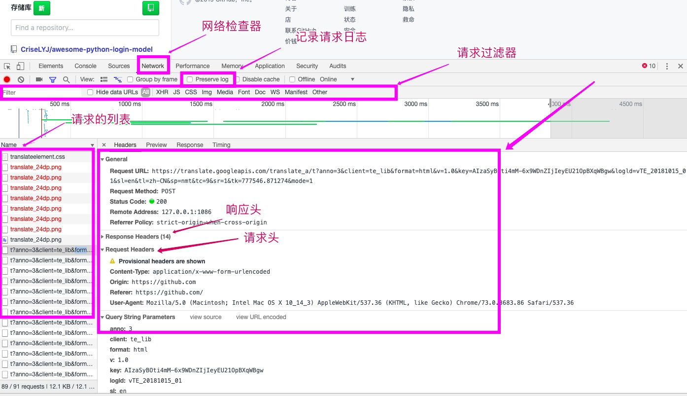
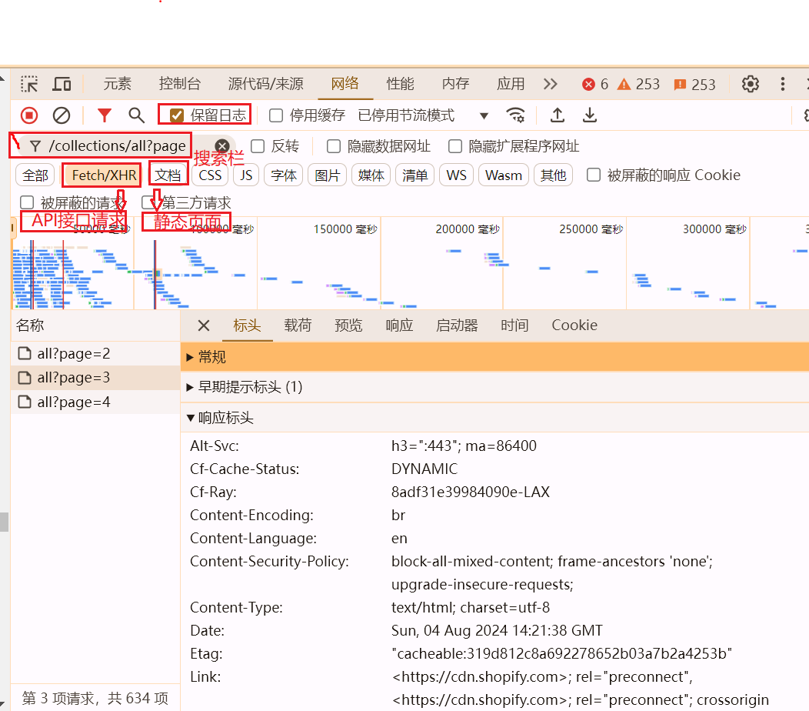
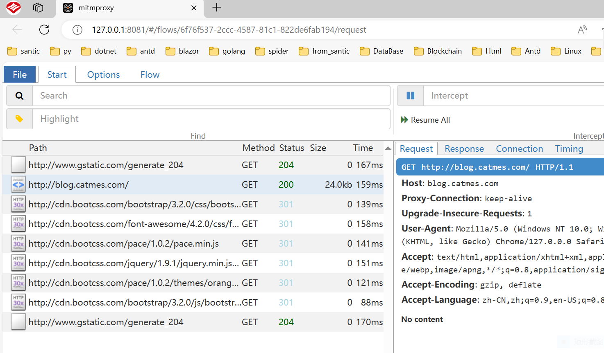

## 网络爬虫概述（概念，分类，流程）

### 爬虫的概念

网络爬虫（英语：web crawler），也叫网络蜘蛛（spider），是一种用来自动浏览万维网的网络机器人。
从一个网络请求页面开始，解析网络响应的数据，再获取新的请求链接，再发起新的网络请求，直到所有页面都爬取完毕为止。
就如同蜘蛛网一般，一个网页为一个结点，通过网页里面的URL链接，与其他网页建立联系，在所有页面节点里抓取数据。

爬虫的本质，就是一个个网络请求的发起和网络响应的解析。

### 爬虫的分类

1. 通用爬虫（泛爬虫）和聚焦爬虫

2. 静态页面和动态的JS渲染页面

3. HTML数据和API数据

4. 网页端和APP端

### 爬虫流程

1. 网站页面分析：检查网页元素和API接口请求，分析URL构造和页面跳转规则
2. 建立数据模型：数据字段映射和类型约束
3. 模拟网络请求：直接构建网络请求，操纵浏览器获取数据
4. 数据清洗和存储：处理异常值、缺失值、重复值...数据存储到PostgreSQL、MongoDB、Mysql...
5. 数据分析和展示：读取分析仓库基础数据，生成导出文件: 如Excel、统计图表

## 底层基础: TCP/IP协议和HTTP协议

### TCP/IP协议简介

TCP/IP 协议，它是全世界互联网数据传输的统一标准和规范。

TCP/IP 协议，应该叫 TCP/IP 协议组(协议族)。是基于TCP和IP这两个最初的协议之上的，不同的通信协议的大的集合。

TCP/IP 协议族可分为五层：物理层、数据链路层、网络层、传输层和应用层。

网络层有 IP 协议、ICMP 协议、ARP 协议、RARP 协议和 BOOTP 协议。

在传输层中有 TCP 协议与 UDP 协议。

在应用层有 HTTP、FTP、TELNET、SMTP、DNS 等协议。

### HTTP协议简介

HTTP 协议是 HyperTextTransferProtocol（超文本传输协议）的缩写。

提到 HTTP 协议，就得提到 TCP/IP 协议，它是全世界互联网数据传输的统一标准和规范。

HTTP 为应用层协议，基于传输层的 TCP 协议，默认占用服务端 80 端口。

特点:在正式的数据传输之前，要先经过 3 次握手确认连接。比 udp 协议速度慢，而可靠性强。

应用场景:平时浏览网页和应用程序的接口数据交互。

请求动作:GET,POST,PUT,DELETE 等。

请求和响应的消息头 header 和消息体 body，都是 HTTP 协议规范内的东西。

### Request，Response和Header

### 数据封装打包

数据的封装打包过程为：原始数据→数据段→数据包→数据帧→比特流

1. 应用层：原始数据被转换成二进制数据
2. 传输层：数据被打上传输层头部比如TCP头部，封装成Segment 数据段。此步关键信息是端口号。
3. 网络层：会给数据打上IP头部，封装成Packet数据包，此步关键信息是源目ip地址。
4. 数据链路层 ：会给数据打上帧头部，封装成Frame数据帧，头部中关键信息是源目MAC地址。
5. 物理层：在网线或者光纤上将二进制数据封装成高低电频信号或者光信号。

数据帧最终在物理层上（双绞线、光纤跳线）上以电信号或光信号进行传播转发。
这种协议栈逐层向下传递数据，并添加报头和报尾的过程称为封装

数据封装与解封装过程: https://zhuanlan.zhihu.com/p/555508423

## 网络抓包工具和MITM中间代理人技术

1. 谷歌浏览器开发者工具: 谷歌浏览器 => 更多工具 => 开发者工具（Ctrl+Shift+I）或者直接按F12键

2. 中间代理人工具mitmproxy: https://www.mitmproxy.org/

3. Charles和Fiddler

## 数据解析和入库

1. CSS选择器和XPATH：HTML和XML
2. JSON解析
3. 正则表达式提取数据

## 爬虫工具和开发框架

| 编程语言 | 类型   | 使用方式 | 名称 |功能| 网址 |
| ----- | --------- | ----------- | ----- | ------- | ----|
| Python | 工具库 | 引入库包 | requests|基础包，简单的HTTP请求|https://github.com/psf/requests|
| Python | 爬虫框架 | 文件框架 |  scrapy | 一体化框架 | https://github.com/scrapy/scrapy|
| Python | 工具库 | 引入库包 |  BeautifulSoup|解析HTML或XML|https://beautifulsoup.readthedocs.io/zh-cn/|
| Python | 工具库 | 引入库包 |  selemiun|解析动态的HTML网页|https://www.selenium.dev/zh-cn/documentation/|
| Python | 工具库 | 引入库包 | DrissionPage |解析动态的HTML网页|https://drissionpage.cn/|
| Go语言 | 工具库 | 引入库包 | net/http|基础包，简单的HTTP请求。原生工具，无需安装| https://pkg.go.dev/net/http |
| Go语言 | 爬虫框架 | 引入库包 | colly| 一体化框架 | https://github.com/gocolly/colly|
| Go语言 | 工具库 | 引入库包 | chromedp|解析动态的HTML网页|https://github.com/chromedp/chromedp|

- Python常用：requests，scrapy，DrissionPage
- Go语言常用：net/http，colly，chromedp

## IP代理池和隧道代理

## 常见反爬技术

## AI辅助

- 通义灵码，可以整合到代码编辑器或IDE https://tongyi.aliyun.com/lingma/
- 通义千问 https://tongyi.aliyun.com/qianwen/
- 深度求索 https://chat.deepseek.com
- KIMI（支持联网搜索） https://kimi.moonshot.cn

## 网络爬虫法律法规

### 爬虫君子协议

- https://www.baidu.com/robots.txt
- https://www.amazon.com/robots.txt
